# AI Blog Publishing Agent — n8n Workflow

A Telegram bot that drafts technical blog posts with one AI agent, has a **second AI
agent review the draft**, and auto-publishes to dev.to if it passes review — with a
menu to browse your existing published posts, and an email notification once something
goes live.

---

## Architecture

```
Telegram message
        │
        ▼
     Switch (rules: See Posts / Create Post / Menu)
        │
   ┌────┼──────────────────────┐
   ▼    ▼                      ▼
 Menu  See Posts             Create Post
   │    │                      │
   │    ▼                      ▼
   │  HTTP GET             Telegram: "what topic?"
   │  dev.to articles      (send & wait, free text)
   │    │                      │
   │    ▼                      ▼
   │  Code node            Content Generator (AI Agent)
   │  (format list)             │
   │    │                       ▼
   │    ▼                  Code node (parse JSON draft)
   │  Telegram: post list        │
   │                             ▼
   ▼                       Reviewer Agent (AI Agent)
 Telegram:                       │
 welcome + buttons                ▼
                            Code node (parse review decision)
                                  │
                                  ▼
                            If: approved by AI?
                            │              │
                            ▼ yes          ▼ no
                      HTTP POST      Telegram: "send feedback"
                      dev.to               │
                        │                  ▼
              ┌─────────┴────────┐   loops back to Content Generator
              ▼                  ▼
        Telegram: "Published!"  Email: published notice
                                 + editorial report
```

### Visual node graph (as it appears on the n8n canvas)

```mermaid
flowchart LR
    A["📱 Telegram Trigger"] --> S["🔀 Switch<br/>Menu / See Posts / Create Post"]
    S -->|Menu| M["👋 Telegram<br/>Welcome + inline buttons"]
    S -->|See Posts| P1["🌐 HTTP GET<br/>dev.to/api/articles/me/published"]
    P1 --> P2["🧹 Code node<br/>Format post list"]
    P2 --> P3["📋 Telegram<br/>Send post list"]
    S -->|Create Post| T["💬 Telegram Send & Wait<br/>Ask for topic (free text)"]
    T --> B["🧠 Content Generator<br/>Gemini + Memory"]
    B --> C["🧹 Code node<br/>Parse draft JSON"]
    C --> R["🕵️ Reviewer Agent<br/>Gemini + Memory"]
    R --> C2["🧹 Code node<br/>Parse review decision"]
    C2 --> E["🔀 If<br/>approved is true"]
    E -->|true| F["🚀 HTTP POST<br/>dev.to/api/articles"]
    E -->|false| G["✏️ Telegram Alert<br/>Ask for feedback"]
    F --> H["✅ Telegram Alert<br/>Published!"]
    F --> N["📧 Email<br/>Published notice + editorial report"]
    G -.loops back to.-> B

    style A fill:#4a9eff,stroke:#2b6fc9,color:#fff
    style S fill:#f5a623,stroke:#c9820f,color:#fff
    style M fill:#4a9eff,stroke:#2b6fc9,color:#fff
    style P1 fill:#22b8a0,stroke:#178a78,color:#fff
    style P2 fill:#22b8a0,stroke:#178a78,color:#fff
    style P3 fill:#4a9eff,stroke:#2b6fc9,color:#fff
    style T fill:#4a9eff,stroke:#2b6fc9,color:#fff
    style B fill:#8e5cf7,stroke:#6a3fc9,color:#fff
    style C fill:#8e5cf7,stroke:#6a3fc9,color:#fff
    style R fill:#8e5cf7,stroke:#6a3fc9,color:#fff
    style C2 fill:#8e5cf7,stroke:#6a3fc9,color:#fff
    style E fill:#f5a623,stroke:#c9820f,color:#fff
    style F fill:#4a9eff,stroke:#2b6fc9,color:#fff
    style G fill:#e0507a,stroke:#b53661,color:#fff
    style H fill:#4a9eff,stroke:#2b6fc9,color:#fff
    style N fill:#22b8a0,stroke:#178a78,color:#fff
```



**Key change from the previous version:** the human email-approval gate is gone from
the publish decision — a second AI agent (the Reviewer) now decides whether the draft
is good enough to publish. The email node that remains is purely a **post-publish
notification** (with the reviewer's editorial report attached), not an approval request.

---

## 1. Prerequisites & installation

### Docker Desktop
Install Docker Desktop for Windows/Mac, or Docker Engine on Linux, before anything else.

### Start n8n (PowerShell — corrected)

The backtick (`` ` ``) is PowerShell's line-continuation character. It **must be the very
last character on the line** with nothing after it, not even a space.

```powershell
docker run -d `
  --name n8n `
  -p 5678:5678 `
  -e N8N_ENFORCE_SETTINGS_FILE_PERMISSIONS=false `
  -e N8N_COMMUNITY_PACKAGES_ENABLED=false `
  -e N8N_UNVERIFIED_PACKAGES_ENABLED=true `
  -v n8n_data:/home/node/.n8n `
  --restart unless-stopped `
  docker.n8n.io/n8nio/n8n
```

One-liner alternative (avoids backtick issues entirely):

```powershell
docker run -d --name n8n -p 5678:5678 -e N8N_ENFORCE_SETTINGS_FILE_PERMISSIONS=false -e N8N_COMMUNITY_PACKAGES_ENABLED=false -e N8N_UNVERIFIED_PACKAGES_ENABLED=true -v n8n_data:/home/node/.n8n --restart unless-stopped docker.n8n.io/n8nio/n8n
```

Open `http://localhost:5678` to confirm n8n is running.

### Start a Cloudflare Tunnel

```powershell
npx cloudflared tunnel --protocol http2 --url http://localhost:5678
```

> **Quick tunnels regenerate a new URL every time you restart them.** For anything
> beyond initial testing, set up a **named Cloudflare Tunnel**
> (`cloudflared tunnel create <name>` + a config file pointing at a domain you own) so
> the URL stays stable across restarts.

### Re-inject the tunnel URL into n8n

```powershell
docker stop n8n
docker rm n8n

docker run -d `
  --name n8n `
  -p 5678:5678 `
  -e WEBHOOK_URL=https://your-tunnel-url.trycloudflare.com/ `
  -e N8N_HOST=your-tunnel-url.trycloudflare.com `
  -e N8N_PROTOCOL=https `
  -e N8N_ENFORCE_SETTINGS_FILE_PERMISSIONS=false `
  -e N8N_COMMUNITY_PACKAGES_ENABLED=false `
  -e N8N_UNVERIFIED_PACKAGES_ENABLED=true `
  -v n8n_data:/home/node/.n8n `
  --restart unless-stopped `
  docker.n8n.io/n8nio/n8n
```

**Do this every time the tunnel URL changes.**

---

## 2. Credentials to set up in n8n

| Credential name | Type | Details |
|---|---|---|
| Google Gemini API | Google PaLM / Gemini API | Paste your Gemini API key (used by both the Content Generator and Reviewer agents) |
| Telegram Bot | Telegram API | Paste your bot token from `@BotFather` |
| Dev.to Header Auth | Header Auth | Header Name field must be the literal HTTP header name `api-key` (not a descriptive label) · Value: your dev.to API key |
| Gmail SMTP | SMTP | Host: `smtp.gmail.com` · Port: `465` (SSL) or `587` (TLS) · User: your Gmail address · Password: 16-character Google App Password |

---

## 3. Node-by-node configuration

### Node — Telegram Trigger
- Credential: your Telegram Bot
- Trigger on: select all

### Node — Switch
- Mode: Rules
- Routing rules:
  1. `{{ $json.callback_query?.data || $json.message?.text || "" }}` contains `"See Posts"` → output: **See Posts**
  2. `{{ $json.callback_query?.data || $json.message?.text || "" }}` contains `"Create Post"` → output: **Create Post**
  3. `{{ ($json.message?.text || "").toLowerCase().trim() }}` matches regex `^(\/start|start|hey|yo|hi|hello)$` → output: **Menu**

> ⚠️ Still worth adding a **fallback/default output** on this Switch, routed to the
> Content Generator branch — free-text revision feedback matches none of these three
> rules and currently has nowhere to go.

### Branch: Menu

#### Node — Telegram (Send Welcome Menu)
- Chat ID: `{{ $json.message.chat.id }}`
- Text: `👋 Welcome! What would you like to do today? Choose an option below:`
- Reply markup: Inline keyboard — `See Posts` / `Create Post` buttons with matching `callback_data`

### Branch: See Posts

#### Node — HTTP Request (get posts req)
- Method: `GET`
- URL: `https://dev.to/api/articles/me/published?per_page=10`
- Authentication: Header Auth → Dev.to Header Auth credential

#### Node — Code in JavaScript1 (format post list)
```javascript
const items = $input.all();

if (!items || items.length === 0 || !items[0].json.id) {
  return [{
    json: { formattedText: "📚 <b>No published articles found on your Dev.to account yet!</b>" }
  }];
}

let textBuffer = "📚 <b>Your Published Dev.to Articles:</b>\n\n";

items.slice(0, 10).forEach((item, index) => {
  const article = item.json;
  const title = article.title || "Untitled Post";
  const url = article.canonical_url || article.url;
  const reactions = article.public_reactions_count || 0;
  const comments = article.comments_count || 0;

  textBuffer += `${index + 1}️⃣ <b><a href="${url}">${title}</a></b>\n`;
  textBuffer += `   ❤️ ${reactions} reactions  |  💬 ${comments} comments\n\n`;
});

return [{ json: { formattedText: textBuffer } }];
```

> ⚠️ **Still present in your latest paste:** the fallback URL is hardcoded as
> `` `https://dev.to/time_pass_d6c977f64396f04/${article.slug}` ``. This was flagged
> before and reappeared unchanged. The dev.to API already returns `article.url` on every
> article object — use that instead of reconstructing a URL with your username baked in
> as a literal string, which breaks the moment this account or username changes.

#### Node — Telegram (see posts list)
- Chat ID: `{{ $json.callback_query?.message?.chat?.id || $json.message?.chat?.id || $('Telegram Trigger').first().json.callback_query?.message?.chat?.id || $('Telegram Trigger').first().json.message?.chat?.id }}`
- Text: `{{ $json.formattedText }}`
- Parse mode: **HTML**

### Branch: Create Post

#### Node — Telegram (Create Post — send & wait, free text)
- Chat ID: `{{ $json.callback_query.message.chat.id }}`
- Message: `✍️ What topic or concept would you like to write about? Please reply to this message with your topic, key points, or target audience.`
- Response type: **Free text**

> ⚠️ **Two things to verify here:**
> 1. This node's Chat ID only reads `callback_query.message.chat.id`, with no fallback
>    to `message.chat.id`. Every other node in this workflow uses a fallback chain
>    (`callback_query?.message?.chat?.id || message?.chat?.id || ...`) because the user
>    can reach "Create Post" either by tapping the inline button (callback_query) or by
>    typing the words "Create Post" as plain text (message). If it's reached via typed
>    text, `callback_query` is undefined and this expression resolves to nothing,
>    silently breaking the chat ID. Recommend matching the same fallback pattern used
>    elsewhere.
> 2. Your Content Generator's prompt reads `{{ $json.message.text }}` for the topic the
>    user typed in reply to this node. Based on how the "approved" field showed up under
>    `data.approved` rather than a top-level field in your earlier Send & Wait (Approval)
>    node, it's likely this free-text response also resumes under a nested field like
>    `{{ $json.data.text }}` rather than `{{ $json.message.text }}`. **Check the actual
>    execution output** for this node (open a test run, inspect the JSON) before trusting
>    the prompt wiring — if it's wrong, the Content Generator will silently receive an
>    empty or undefined topic instead of the user's actual reply.

#### Node — Content Generator (AI Agent)
- Prompt (User Message): `{{ $json.message.text }}` *(verify against note above)*
- **System Message:**

```
You are an expert technical writer and automated developer relations (DevRel) publisher
specializing in Software Engineering, DevOps, Cloud Infrastructure, and Full-Stack Web
Development.

### GOAL:
Draft high-quality, CTR-optimized technical articles for Dev.to based on user prompts,
or refine previous drafts using user revision feedback.

### CONTEXT & MEMORY MANAGEMENT:
1. ALWAYS review the conversation history before generating a response.
2. NEW TOPIC: If the user provides a new topic, create a complete, in-depth technical
   article in Dev.to Markdown.
3. REVISION REQUEST: If the user provides feedback, corrections, or requests
   modifications to a draft present in the conversation history, edit and update that
   specific draft according to their instructions. Preserve the existing code and
   structure where applicable, adjusting only what was requested.

### ARTICLE REQUIREMENTS:
- Catchy, clear title suitable for developers.
- 3-4 relevant lower-case tags (e.g., docker, devops, node, javascript, webdev).
- Clear headers, setup/installation steps, clean code blocks, and practical real-world
  usage examples.

### OUTPUT FORMAT:
Respond ONLY with a single valid JSON object.
DO NOT wrap the output in markdown code fences.

Strict JSON Schema:
{
  "title": "Article Title Here",
  "tags": ["tag1", "tag2", "tag3"],
  "body_markdown": "# Title\n\nArticle introduction...\n\n## Setup\n\n```bash\ncode here\n```"
}
```

- **Sub-node — Chat model:** Google Gemini Chat Model, credential = Gemini account,
  model = `models/gemini-3.1-flash-lite`
- **Sub-node — Memory:** Simple Memory, Session ID key:
  `{{ $('Telegram Trigger').first()?.json?.message?.chat?.id || $('Telegram Trigger').first()?.json?.callback_query?.from?.id || $('Telegram Trigger').first()?.json?.callback_query?.message?.chat?.id }}`,
  Context Window Length `10`

#### Node — Code in JavaScript (parse draft JSON)
```javascript
let rawOutput = $json.output || '';
if (typeof rawOutput === 'string') {
  rawOutput = rawOutput.replace(/^```json\s*/i, '').replace(/```\s*$/i, '').trim();
}

let parsedOutput = {};
try {
  parsedOutput = typeof rawOutput === 'string' ? JSON.parse(rawOutput) : rawOutput;
} catch (e) {
  parsedOutput = { body_markdown: rawOutput };
}

const title = parsedOutput.title || '';
const tags = Array.isArray(parsedOutput.tags) ? parsedOutput.tags : [];
let markdown = parsedOutput.body_markdown || (typeof rawOutput === 'string' ? rawOutput : '');

let htmlBody = markdown
  .replace(/```(\w+)?\n([\s\S]*?)```/g, '<pre style="background:#1e1e1e;color:#d4d4d4;padding:12px;border-radius:6px;overflow-x:auto;"><code>$2</code></pre>')
  .replace(/`([^`]+)`/g, '<code style="background:#e9ecef;padding:2px 5px;border-radius:4px;font-family:monospace;">$1</code>')
  .replace(/^### (.*$)/gim, '<h3 style="color:#0f172a;margin-top:20px;">$1</h3>')
  .replace(/^## (.*$)/gim, '<h2 style="color:#0f172a;border-bottom:1px solid #e2e8f0;padding-bottom:6px;margin-top:24px;">$1</h2>')
  .replace(/^# (.*$)/gim, '<h1 style="color:#0f172a;">$1</h1>')
  .replace(/\*\*(.*?)\*\*/g, '<strong>$1</strong>')
  .replace(/\*(.*?)\*/g, '<em>$1</em>')
  .replace(/^\* (.*$)/gim, '<li style="margin-bottom:4px;">$1</li>')
  .replace(/^- (.*$)/gim, '<li style="margin-bottom:4px;">$1</li>')
  .replace(/\n\n/g, '<br/><br/>');

return { title, tags, formatted_html: htmlBody, raw_markdown: markdown };
```

#### Node — Reviewer Agent (AI Agent)
- Prompt (User Message): `{{ JSON.stringify($('Code in JavaScript').first().json) }}`
- **System Message:**

```
You are a Senior Technical Editor at a premier developer publication. Your job is to
rigorously review technical article drafts before they are published on Dev.to.

EVALUATION CRITERIA:
1. Structure & Depth: Does it have clear H2/H3 headings and actionable explanations?
2. Code Quality: Are code snippets present, accurate, and properly formatted in
   language code blocks?
3. Tags: Are there 2-4 lowercase relevant tags?
4. Accuracy: Is the technical terminology correct?

OUTPUT FORMAT:
Respond ONLY with a single valid JSON object. Do NOT wrap output in markdown code fences.

{
  "approved": true,
  "quality_score": 9,
  "editorial_summary": "Excellent technical article with valid code snippets and strong structure.",
  "improvements_made": "Verified markdown tag formatting and header hierarchy."
}
```

- **Sub-node — Chat model:** Google Gemini Chat Model, model = Gemini 3.5 Flash Lite
  *(check the exact model string in n8n's dropdown — provider model IDs change over time)*
- **Sub-node — Memory:** Simple Memory, same session key pattern as Content Generator,
  Context Window Length `5`

> ⚠️ Note that the Reviewer Agent is currently self-graded and self-approved by the same
> family of model as the writer, with no external/human check in the loop anymore. If
> quality drifts, there's no human gate to catch it before publish — worth deciding
> whether that trade-off (full automation vs. a human review step) is intentional for
> your use case.

#### Node — Code in JavaScript (parse review decision)
```javascript
let raw = $json.output || $json.text || '';
if (typeof raw === 'string') {
  raw = raw.replace(/^```json\s*/i, '').replace(/```\s*$/i, '').trim();
}

let parsed = {};
try {
  parsed = typeof raw === 'string' ? JSON.parse(raw) : raw;
} catch (e) {
  parsed = { approved: false, editorial_summary: "Failed to parse AI review output." };
}

return {
  approved: Boolean(parsed.approved),
  quality_score: parsed.quality_score || 0,
  editorial_summary: parsed.editorial_summary || "No summary provided.",
  improvements_made: parsed.improvements_made || "None"
};
```

Note the fail-safe here: if the reviewer's output doesn't parse as JSON, `approved`
defaults to `false` — a parsing failure blocks publishing rather than accidentally
allowing it through. Good defensive default, keep it.

#### Node — If (Is Approved by AI?)
- Condition: `{{ $json.approved }}` is `true`

#### Node — HTTP Request (create post req) — True branch
- Method: `POST`
- URL: `https://dev.to/api/articles`
- Authentication: Header Auth → Dev.to Header Auth credential (Header Name must literally be `api-key`)

```javascript
{{
(() => {
  const codeData = $('Code in JavaScript').first().json;

  let tags = [];
  if (Array.isArray(codeData.tags)) {
    tags = codeData.tags.map(t => String(t).replace(/#/g, '').trim().toLowerCase());
  } else if (typeof codeData.tags === 'string') {
    tags = codeData.tags.split(',').map(t => t.replace(/#/g, '').trim().toLowerCase());
  }

  tags = tags.map(t => t.replace(/[^a-z0-9]/g, '')).filter(Boolean).slice(0, 4);
  if (tags.length === 0) tags = ['n8n', 'automation'];

  return JSON.stringify({
    article: {
      title: codeData.title || "Automated Article",
      published: true,
      body_markdown: codeData.raw_markdown || "# Default Title\n\nContent coming soon.",
      tags: tags
    }
  });
})()
}}
```

This version is more defensive than the earlier one — it lowercases tags, strips
non-alphanumeric characters, and falls back to default tags if none survive filtering.
Good improvement to keep.

#### Node — Telegram (post success message) — after publish
- Chat ID: `{{ $('Telegram Trigger').first()?.json?.message?.chat?.id || $('Telegram Trigger').first()?.json?.callback_query?.from?.id || $('Telegram Trigger').first()?.json?.callback_query?.message?.chat?.id }}`
- Text: `🎉 <b>Blog post successfully published!</b> 📌 <b>Title:</b> {{ $('Code in JavaScript').first().json.title }} 🔗 <b>URL:</b> https://dev.to{{ $json.path }}`
- Parse mode: **HTML**

#### Node — Send Published Version Email — after publish
- Subject: `🚀 [PUBLISHED] {{ $('Code in JavaScript').first().json.title }}`
- Email format: HTML, includes the editorial report (`quality_score`, `editorial_summary`,
  `improvements_made` from the Parse Review Decision node) plus the full rendered draft

> ⚠️ **This node's Operation is set to "Send and wait for response,"** but nothing in
> the workflow reads a response from it — it's a one-way "FYI, this went live" email
> with no branching afterward. "Send and wait" pauses the execution and keeps a webhook
> open expecting a reply that will never come, which either sits open indefinitely or
> errors out once n8n's wait-timeout is hit, for no benefit. Change the Operation to
> plain **Send** — you'll get the same email with none of the hanging-execution risk.

#### Node — Telegram (feedback message) — False branch
- Chat ID: same fallback chain as the success message
- Text: `✏️ <b>Revisions requested</b> Draft: <b>{{ $('Code in JavaScript').first().json.title || 'Technical Article' }}</b> was not published. Please reply to this chat with your exact feedback...`
- Parse mode: **HTML**

---

## 4. Bugs we hit and fixed along the way

| Symptom | Root cause | Fix |
|---|---|---|
| Email fields (title, tags, draft) all empty | System prompt returned freeform Markdown with no separate `title`/`tags` fields | Force strict JSON output schema, parse in a Code node |
| Approve/Decline buttons overlapped | Hand-coded inline-block/flex buttons don't render reliably in email clients | Use n8n's built-in Approval response type |
| `404: no waiting webhook with matching path/method` | `resumeUrl` links used `&` instead of `?`, or Wait node method was POST while email links are GET | Use `?` for the first query param; set Wait node method to GET/Any |
| `invalid token` on resume links | Workflow edited mid-execution, token reused after a click, or tunnel URL changed between send and click | Fresh runs per test; stable tunnel; named tunnel for production |
| Underscores disappearing from usernames/titles in Telegram messages | Markdown parse mode treats `_..._` as italics | Use HTML parse mode + `<b>` tags everywhere |
| `Header name must be a valid HTTP token ["Dev.to Header Auth"]` | Credential's Header Name field held a descriptive label instead of `api-key` | Set Header Name to the literal token `api-key` |
| Workflow routed to False branch even on Approve | If node checked `{{ $json.action }}`, which doesn't exist on Send & Wait output | Use `{{ $json.data.approved }}`, Is Boolean → True |
| Hardcoded username in "See Posts" fallback URL | `` `https://dev.to/USERNAME/${slug}` `` baked in one account's name — **still present in the latest version** | Use `article.url` from the API response instead |
| Revision feedback messages have nowhere to route | Switch node only matches specific phrases/greeting, no fallback output | Add a Switch fallback output routed to Content Generator |
| Create Post node's Chat ID may break for typed (non-button) entry | Reads only `callback_query.message.chat.id`, no fallback to `message.chat.id` | Use the same fallback chain as every other node |
| Content Generator's prompt may silently receive an empty topic | `{{ $json.message.text }}` likely doesn't match the actual field a Telegram free-text Send & Wait resumes with (probably nested under `data.text`, by analogy with `data.approved`) | Inspect the real execution output for that node and correct the expression before relying on it |
| Published-notification email could hang the execution | Operation set to "Send and wait for response" with nothing downstream reading a reply | Change Operation to plain **Send** |

---

## 5. Docker maintenance commands

```powershell
# Stop / start without losing data (workflows live in the n8n_data volume)
docker stop n8n
docker start n8n

# Fully remove the container (keeps the volume/data)
docker stop n8n
docker rm n8n

# Check disk usage before cleaning up
docker system df

# Remove unused images/containers (safe cleanup, keeps n8n_data volume)
docker system prune -a

# Remove the n8n data volume — DESTRUCTIVE, deletes all workflows/credentials
docker volume rm n8n_data

# Check live RAM/CPU usage of the running container
docker stats n8n

# Free up RAM immediately without deleting anything
docker stop n8n
```

---

## 6. Testing checklist

- [ ] Send `/start` or "hi" → welcome menu with inline buttons appears
- [ ] Tap **See Posts** → published articles list shows correct titles/URLs (verify the URL isn't silently falling back to a hardcoded username)
- [ ] Tap **Create Post**, confirm the "what topic?" prompt arrives, reply with a topic → confirm the Content Generator actually receives your topic text (check its input in the execution log, not just its output)
- [ ] Confirm the draft passes to the Reviewer Agent and its `approved`/`quality_score`/`editorial_summary` fields populate correctly in the Parse Review Decision node
- [ ] Force a low-quality draft (or edit the reviewer prompt temporarily) to confirm the **False** branch fires correctly and the feedback Telegram message sends
- [ ] Confirm a real publish: dev.to POST succeeds, Telegram "published" message shows the correct URL with underscores intact, and the notification email sends without hanging the execution
- [ ] Restart the tunnel and confirm `WEBHOOK_URL` was updated before re-testing
