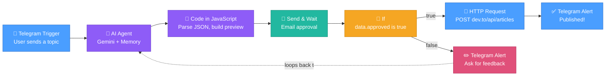

# AI Blog Publishing Agent — n8n Workflow

An automated pipeline that takes a topic from Telegram, drafts a full technical blog post
with an LLM, sends it to you for email approval, and publishes the approved version
straight to dev.to.

---

## Architecture

```
Telegram message (topic)
        │
        ▼
  AI Agent (Gemini + memory)  ──►  drafts JSON: title, tags, body_markdown
        │
        ▼
  Code node (parse/clean JSON, build HTML preview)
        │
        ▼
  Send & Wait (email) ──► you get an email with Approve / Decline buttons
        │
        ▼
  If: approved?
     │                     │
     ▼ yes                 ▼ no
  HTTP POST dev.to     Telegram: "send your feedback"
     │                     │
     ▼                     ▼
  Telegram: "Published!"   loops back to AI Agent with your feedback
```

### Visual node graph (as it appears on the n8n canvas)



**How to read this:** the flow runs left → right through the main chain. At the If node
it forks: the top path (green/blue) fires when you approve — it publishes to dev.to and
sends a success alert. The bottom path (pink) fires when you decline — it asks for your
feedback over Telegram, then loops back into the AI Agent's memory so the next message
you send is treated as a revision, not a new topic.

---

## 1. Prerequisites & installation

### Docker Desktop
Install Docker Desktop for Windows/Mac, or Docker Engine on Linux, before anything else.

### Start n8n (PowerShell — corrected)

The backtick (`` ` ``) is PowerShell's line-continuation character. It **must be the very
last character on the line** with nothing after it, not even a space — this is the most
common cause of the command silently failing or merging into one broken line.

```powershell
docker run -d `
  --name n8n `
  -p 5678:5678 `
  -e N8N_ENFORCE_SETTINGS_FILE_PERMISSIONS=false `
  -e N8N_COMMUNITY_PACKAGES_ENABLED=false `
  -e N8N_UNVERIFIED_PACKAGES_ENABLED=true `
  -v n8n_data:/home/node/.n8n `
  --restart unless-stopped `
  docker.n8n.io/n8nio/n8n
```

If you'd rather avoid backtick issues entirely, use the one-liner version instead:

```powershell
docker run -d --name n8n -p 5678:5678 -e N8N_ENFORCE_SETTINGS_FILE_PERMISSIONS=false -e N8N_COMMUNITY_PACKAGES_ENABLED=false -e N8N_UNVERIFIED_PACKAGES_ENABLED=true -v n8n_data:/home/node/.n8n --restart unless-stopped docker.n8n.io/n8nio/n8n
```

Open `http://localhost:5678` to confirm n8n is running.

### Start a Cloudflare Tunnel (exposes n8n publicly for webhooks)

```powershell
npx cloudflared tunnel --protocol http2 --url http://localhost:5678
```

This prints a random URL like `https://random-words-1234.trycloudflare.com`. Copy it.

> **Quick tunnels regenerate a new URL every time you restart them.** This breaks any
> email/webhook links sent before the restart. For anything beyond initial testing, set
> up a **named Cloudflare Tunnel** (`cloudflared tunnel create <name>` + a config file
> pointing at a domain you own) so the URL stays stable across restarts.

### Re-inject the tunnel URL into n8n

n8n needs to know its own public address so that `resumeUrl` and webhook URLs it
generates point somewhere reachable — otherwise email approval links and Telegram
callbacks will fail. Restart the container with `WEBHOOK_URL` set:

```powershell
docker stop n8n
docker rm n8n

docker run -d `
  --name n8n `
  -p 5678:5678 `
  -e WEBHOOK_URL=https://your-tunnel-url.trycloudflare.com/ `
  -e N8N_HOST=your-tunnel-url.trycloudflare.com `
  -e N8N_PROTOCOL=https `
  -e N8N_ENFORCE_SETTINGS_FILE_PERMISSIONS=false `
  -e N8N_COMMUNITY_PACKAGES_ENABLED=false `
  -e N8N_UNVERIFIED_PACKAGES_ENABLED=true `
  -v n8n_data:/home/node/.n8n `
  --restart unless-stopped `
  docker.n8n.io/n8nio/n8n
```

**Do this every time the tunnel URL changes** (i.e. every restart, unless you're using a
named tunnel).

---

## 2. Credentials to set up in n8n

Go to **Credentials → New** for each of these:

| Credential name | Type | Details |
|---|---|---|
| Google Gemini API | Google PaLM / Gemini API | Paste your Gemini API key |
| Telegram Bot | Telegram API | Paste your bot token from `@BotFather` |
| Dev.to Header Auth | Header Auth | Name field must be the literal HTTP header name `api-key` (not a descriptive label like "Dev.to Header Auth") · Value: your dev.to API key (Settings → Extensions on dev.to) |
| Gmail SMTP | SMTP | Host: `smtp.gmail.com` · Port: `465` (SSL) or `587` (TLS) · User: your Gmail address · Password: 16-character Google App Password (not your normal password) |

---

## 3. Node-by-node configuration

### Node 1 — Telegram Trigger
- Credential: your Telegram Bot
- Trigger on: select all

### Node 2 — AI Agent

- **Prompt (User Message)**, set to expression: `{{ $json.message.text }}`
- **System Message:**

```
You are an expert technical writer and automated developer relations (DevRel) publisher
specializing in Software Engineering, DevOps, Cloud Infrastructure, and Full-Stack Web
Development.

### GOAL:
Draft high-quality, CTR-optimized technical articles for Dev.to based on user prompts,
or refine previous drafts using user revision feedback.

### CONTEXT & MEMORY MANAGEMENT:
1. ALWAYS review the conversation history before generating a response.
2. NEW TOPIC: If the user provides a new topic, create a complete, in-depth technical
   article in Dev.to Markdown.
3. REVISION REQUEST: If the user provides feedback, corrections, or requests
   modifications to a draft present in the conversation history, edit and update that
   specific draft according to their instructions. Preserve the existing code and
   structure where applicable, adjusting only what was requested.

### ARTICLE REQUIREMENTS:
- Catchy, clear title suitable for developers.
- 3-4 relevant lower-case tags (e.g., docker, devops, node, javascript, webdev).
- Clear headers, setup/installation steps, clean code blocks, and practical real-world
  usage examples.

### OUTPUT FORMAT:
Respond ONLY with a single valid JSON object.
DO NOT wrap the output in markdown code fences.

Strict JSON Schema:
{
  "title": "Article Title Here",
  "tags": ["tag1", "tag2", "tag3"],
  "body_markdown": "# Title\n\nArticle introduction...\n\n## Setup\n\n```bash\ncode here\n```"
}
```

**Sub-node — Chat model (Google Gemini):** credential = your Gemini account, model =
`models/gemini-3.1-flash-lite` (check n8n's model dropdown for the current available
Gemini model name, since provider model IDs change over time)

**Sub-node — Memory (Simple Memory):**
- Session ID: Define below
- Key: `{{ $('Telegram Trigger').item.json.message.chat.id }}`
- Context Window Length: `10`

### Node 3 — Code in JavaScript
- Mode: Run once for each item
- Language: JavaScript

```javascript
// Clean potential backticks or markdown JSON wrappers from LLM string output
let rawOutput = $json.output || '';
if (typeof rawOutput === 'string') {
  rawOutput = rawOutput.replace(/^```json\s*/i, '').replace(/```\s*$/i, '').trim();
}

// Parse JSON string
let parsedOutput = {};
try {
  parsedOutput = typeof rawOutput === 'string' ? JSON.parse(rawOutput) : rawOutput;
} catch (e) {
  parsedOutput = { body_markdown: rawOutput };
}

// Extract fields
const title = parsedOutput.title || '';
const tags = Array.isArray(parsedOutput.tags) ? parsedOutput.tags : [];
let markdown = parsedOutput.body_markdown || (typeof rawOutput === 'string' ? rawOutput : '');

// Basic Markdown -> HTML for the email preview
let htmlBody = markdown
  .replace(/```(\w+)?\n([\s\S]*?)```/g, '<pre style="background:#1e1e1e;color:#d4d4d4;padding:12px;border-radius:6px;overflow-x:auto;"><code>$2</code></pre>')
  .replace(/`([^`]+)`/g, '<code style="background:#e9ecef;padding:2px 5px;border-radius:4px;font-family:monospace;">$1</code>')
  .replace(/^### (.*$)/gim, '<h3 style="color:#0f172a;margin-top:20px;">$1</h3>')
  .replace(/^## (.*$)/gim, '<h2 style="color:#0f172a;border-bottom:1px solid #e2e8f0;padding-bottom:6px;margin-top:24px;">$1</h2>')
  .replace(/^# (.*$)/gim, '<h1 style="color:#0f172a;">$1</h1>')
  .replace(/\*\*(.*?)\*\*/g, '<strong>$1</strong>')
  .replace(/\*(.*?)\*/g, '<em>$1</em>')
  .replace(/^\* (.*$)/gim, '<li style="margin-bottom:4px;">$1</li>')
  .replace(/^- (.*$)/gim, '<li style="margin-bottom:4px;">$1</li>')
  .replace(/\n\n/g, '<br/><br/>');

return {
  title: title,
  tags: tags,
  formatted_html: htmlBody,
  raw_markdown: markdown
};
```

### Node 4 — Send message and wait for response (email)
- Credential: SMTP account
- Operation: **Send and wait for response**
- From / To: your addresses
- Subject: `[DRAFT REVIEW] {{ $json.title }}`
- **Message HTML** (table-based buttons, no overlap):

```html
<div style="font-family: -apple-system, BlinkMacSystemFont, 'Segoe UI', Roboto, Helvetica, Arial, sans-serif; max-width: 700px; margin: 0 auto; background: #ffffff; border: 1px solid #e2e8f0; border-radius: 12px; padding: 28px; color: #1e293b; box-shadow: 0 4px 6px -1px rgba(0,0,0,0.05);">

  <!-- Header Badge & Title -->
  <div style="border-bottom: 2px solid #f1f5f9; padding-bottom: 20px; margin-bottom: 24px;">
    <span style="background: #eff6ff; color: #2563eb; padding: 6px 12px; border-radius: 20px; font-size: 12px; font-weight: 700; letter-spacing: 0.5px; text-transform: uppercase;">Draft Review</span>
    
    <h1 style="font-size: 24px; font-weight: 800; color: #0f172a; margin: 16px 0 10px 0; line-height: 1.3;">
      {{ $json.title || 'Technical Article Draft' }}
    </h1>
    
    <div style="font-size: 14px; color: #64748b;">
      <strong style="color: #475569;">Tags:</strong> 
      {{ $json.tags ? $json.tags.join(', ') : 'devops, programming' }}
    </div>
  </div>

  <!-- Dev.to Article Preview -->
  <div style="line-height: 1.7; font-size: 15px; color: #334155; margin-bottom: 32px;">
    {{ $json.formatted_html }}
  </div>

  <!-- Divider -->
  <hr style="border: 0; border-top: 1px solid #e2e8f0; margin: 32px 0;" />

  <!-- Action Callout & Dual Buttons -->
  <div style="text-align: center; background: #f8fafc; border-radius: 8px; padding: 20px;">
    <p style="font-size: 14px; font-weight: 600; color: #475569; margin: 0 0 16px 0;">
      Please review the content above and choose an action:
    </p>

    <div style="display: inline-flex; gap: 12px; align-items: center; justify-content: center; flex-wrap: wrap;">
    </div>

  </div>

</div>
```

- **Response type:** Approval
- **Approval Options:**
  - Type of approval: Approve and disapprove
  - Approve button label: `Approve`, style: `Primary`
  - Disapprove button label: `Decline`, style: `Secondary`

> n8n's built-in Approval response type generates and styles the two buttons itself —
> you don't need to hand-code button HTML/links for this response type. Hand-coded
> `resumeUrl` buttons are only needed if you're using the generic **Send and wait for
> response → Free text / Custom form** option instead.

### Node 5 — If
- Condition: `{{ $json.data.approved }}` → **Is Boolean → True**
- Do **not** use `{{ $json.action }}` — that field doesn't exist on Send & Wait's output
  and will always be undefined, silently routing every execution to the False branch
  even when you click Approve. The Send & Wait (Approval) node returns its result under
  `data.approved`, not `action`.

### Node 6 — HTTP Request (dev.to publish) — True branch
- Method: `POST`
- URL: `https://dev.to/api/articles`
- Authentication: Generic Credential Type → Header Auth → your Dev.to Header Auth credential
- Send Headers: on → `api-key: <your dev.to api key>`
- Send Body: on → Specify Body: JSON

> The credential's **Header Name** field must contain the literal token `api-key`.
> HTTP header names must be valid HTTP tokens — no spaces, no descriptive text. If you
> type something like "Dev.to Header Auth" into that field (easy to do, since it's also
> the credential's display name elsewhere in n8n), the request fails with
> `Header name must be a valid HTTP token`. The credential's display name and its
> Header Name field are two separate things — only the latter goes on the wire.

```javascript
{{
(() => {
  const codeData = $('Code in JavaScript').first().json;

  let cleanTags = [];
  if (Array.isArray(codeData.tags)) {
    cleanTags = codeData.tags.map(t => String(t).replace(/#/g, '').trim());
  } else if (typeof codeData.tags === 'string') {
    cleanTags = codeData.tags.split(',').map(t => t.replace(/#/g, '').trim());
  }

  return JSON.stringify({
    article: {
      title: codeData.title || 'Technical Article',
      published: true,
      body_markdown: codeData.raw_markdown || '',
      tags: cleanTags.slice(0, 4) // dev.to allows max 4 tags
    }
  });
})()
}}
```

### Node 7 — Telegram Alert (False branch — needs revision)
- Chat ID: `{{ $('Telegram Trigger').item.json.message.chat.id }}`
- **Parse mode: HTML** (see "Bugs fixed" below for why)

```html
✏️ <b>Revisions requested</b>
Draft: <b>{{ $('Code in JavaScript').first().json.title || 'Technical Article' }}</b> was not published.
Please reply to this chat with your exact feedback (e.g. "Add more code examples for Nginx configuration" or "Simplify the introduction"). The agent will update the draft using your feedback.
```

### Node 8 — Telegram Alert (True branch — published)
- Chat ID: `{{ $('Telegram Trigger').item.json.message.chat.id }}`
- **Parse mode: HTML**

```html
🎉 <b>Blog post successfully published!</b>
📌 <b>Title:</b> {{ $('Code in JavaScript').first().json.title }}
🔗 <b>URL:</b> https://dev.to{{ $json.path }}
```

---

## 4. Bugs we hit and fixed along the way

| Symptom | Root cause | Fix |
|---|---|---|
| Email fields (title, tags, draft) all empty | System prompt returned freeform Markdown with no separate `title`/`tags` fields to map | Force strict JSON output schema from the LLM, parse it in a Code node before the email node |
| Approve/Decline buttons overlapped | Buttons built with inline-block/flex, which many email clients don't render reliably | Use n8n's built-in **Approval** response type, which renders buttons safely, or a `<table><td>` layout if hand-coding |
| `404: no waiting webhook with matching path/method` | `resumeUrl` links built with `&` instead of `?` for the first query param, OR Wait node's HTTP method set to POST while email links are always GET | Use `?approved=true` (first param needs `?` not `&`); confirm Wait node's method is GET or Any |
| `invalid token` on resume links | Workflow edited while an execution was paused waiting on that token, OR button already clicked once (tokens are single-use), OR tunnel URL changed between send and click | Don't edit workflow mid-test; trigger a fresh run per test; keep tunnel/n8n stable between send and click, or use a named tunnel |
| Underscores disappearing from dev.to username in Telegram message | Telegram's Markdown parse mode treats `_..._` as italics and silently consumes single underscores as formatting | Switch the Telegram node's parse mode to **HTML** and use `<b>` instead of `*bold*` — underscores are then treated as literal characters |
| dev.to URL/title vanish or truncate unexpectedly in other message fields | Same underscore-swallowing issue can hit any field with underscores under Markdown parse mode | Standardize on HTML parse mode across all Telegram/Send-Message nodes |
| `HTTP Request: Header name must be a valid HTTP token ["Dev.to Header Auth"]` | The credential's Header Name field was set to the descriptive label "Dev.to Header Auth" instead of the actual HTTP header name | Set Header Name to `api-key` (the literal header dev.to expects) and put the token itself in the Value field |
| Workflow routed to the **False** branch even when clicking Approve | The If node's condition checked `{{ $json.action }}`, which doesn't exist on Send & Wait's output — it's always undefined, which is falsy | Change the condition to `{{ $json.data.approved }}` using **Is Boolean → True** |

---

## 5. Docker maintenance commands

### Stop / start without losing data
Your workflows live in the `n8n_data` volume, not the container — stopping or removing
the container is safe as long as you don't remove the volume.

```powershell
docker stop n8n
docker start n8n
```

### Fully remove the container (keeps the volume/data)
```powershell
docker stop n8n
docker rm n8n
```

### Reclaim disk space — check usage first
```powershell
docker system df
```
Shows how much space images, containers, and volumes are using.

### Remove unused images/containers (safe cleanup, keeps your n8n_data volume)
```powershell
docker system prune -a
```
`-a` also removes unused images, not just stopped containers — confirm before running.

### Remove the n8n data volume (DESTRUCTIVE — deletes all workflows/credentials)
```powershell
docker volume rm n8n_data
```
Only run this if you genuinely want to wipe everything and start fresh.

### Check live RAM/CPU usage of the running container
```powershell
docker stats n8n
```
Press `Ctrl+C` to exit the live view.

### Free up RAM immediately without deleting anything
```powershell
docker stop n8n
```
Stopping releases the container's RAM back to the system; `docker start n8n` resumes
with all data intact.

---

## 6. Testing checklist

- [ ] Send a topic via Telegram → confirm AI Agent returns valid JSON (check Code node output)
- [ ] Confirm review email arrives with title, tags, and preview populated
- [ ] Click **Approve** → confirm dev.to POST succeeds and Telegram "published" message shows the correct URL with underscores intact
- [ ] Click **Decline** → confirm Telegram asks for feedback, and that replying with feedback correctly triggers a revised draft (check AI Agent memory picks up the chat history)
- [ ] Restart the tunnel and confirm `WEBHOOK_URL` was updated before re-testing any email links
